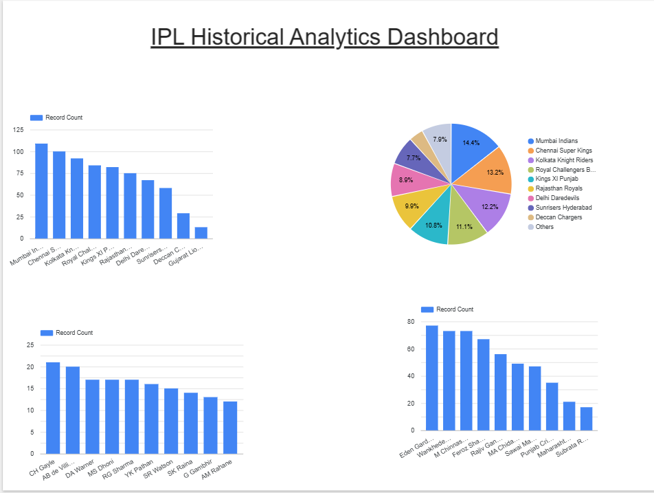

# IPL Historical Data Analytics Pipeline

## 📊 Project Overview
An end-to-end cloud-based data analytics pipeline built using IPL historical match data.  
The project demonstrates ETL processing, cloud storage, SQL analytics, and dashboard visualization.

## 🏗️ Architecture
Kaggle Dataset → Python (Pandas ETL) → Google BigQuery → Looker Studio Dashboard

## ⚙️ Tech Stack
- Python (Pandas)
- Google BigQuery
- SQL
- Looker Studio
- Kaggle Dataset

## 🔍 Key Features
- Cleaned and transformed multi-season IPL dataset
- Loaded structured data into BigQuery cloud warehouse
- Executed SQL queries for analytics
- Built interactive dashboard for insights

## 📈 Dashboard Insights
- Wins by team
- Matches by venue
- Top players by awards
- Team participation analysis

## 🖼️ Dashboard Preview

## 📁 Dataset Source
IPL Historical Dataset — Kaggle

## 👨‍💻 Author
Harsh Chauhan